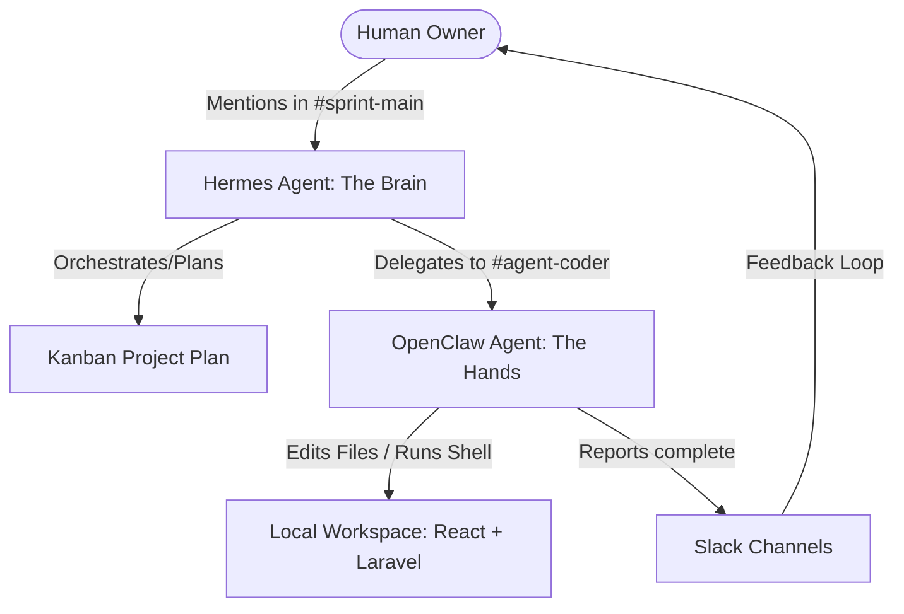

# System Architecture — Forge 2 Two-Agent System

This document outlines the multi-agent orchestration architecture used to build the Kanban application.

## System Topology

## Agent Roles and Functions

### 1. Hermes (The Brain)
- **Role:** High-level planner and orchestrator.
- **Responsibilities:**
  - Decomposes user goals into steps.
  - Maintains persistent memory across sessions.
  - Deploys skills (like custom status reports).
  - Integrates with cron for automated monitoring/notifications.
- **Model:** `Google Gemini 2.5-flash` for high-concurrency planning and cheap token usage.

### 2. OpenClaw (The Hands)
- **Role:** Active coder and shell execution environment.
- **Responsibilities:**
  - Inspects workspace code, edits files, and creates routes/controllers.
  - Runs local compiler tests, migrations, and npm scripts.
  - Interfaces directly with the codebase via tool usage.
- **Model:** `Google Gemini 2.5-flash` (via OpenAI compatibility) for reliable tool utilization and schema conformance during file editing.

---

## Slack Channel Routing Scheme

Everything is wired to a private Slack workspace (`NMG Slack`):

1. **`#sprint-main`** (C0BC3PX6GSD)
   - **Purpose:** Humans talk to Hermes. Main plans, high-level decisions, and manual interventions occur here.
2. **`#agent-coder`** (C0BCW7A3F2L)
   - **Purpose:** Hermes assigns detailed programming subtasks to OpenClaw. OpenClaw posts its diffs and terminal test outcomes here.
3. **`#agent-log`** (C0BCW7AFPKJ)
   - **Purpose:** Unified gateway feed logging all raw agent activity and background event occurrences.

---

## Model Selection and Routing Rationale

| Layer | Provider | Model | Rationale |
| :--- | :--- | :--- | :--- |
| **Planning & Cron** | Google AI Studio | `gemini-2.5-flash` | Outstanding context length, zero-latency parsing, and generous free limits for planning loops. |
| **Coding & Terminal** | Google Gemini (OpenAI compat) | `gemini-2.5-flash` | Generous context length and robust JSON/tool schemas to ensure reliable file operations and coding loops. |
